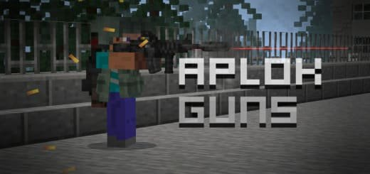
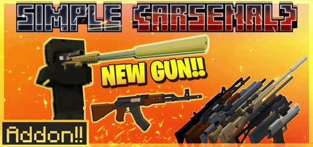

# Особливості цієї збірки
Усі представлені моди створюють гармонійну екосистему для Майнкрафт ПЕ (Бідрок) 1.21.72+. Вони ідеально доповнюють один одного: візуальні покращення працюють у тандемі з новими ігровими механіками, а зручні інструменти спрощують взаємодію з іншими доповненнями для гри Counter-Strike 1.6 у Minecraft Bedrock Edition (PE)
  
Особливу увагу приділено оптимізації - моди не конфліктують між собою та демонструють стабільну роботу навіть за спільної установки. Для досягнення кращої продуктивності рекомендується використовувати не більше 7-8 мод одночасно, особливо на мобільних пристроях.
> [!Warning]
> Це доповнення НЕ потребує експериментальних опцій. Будь ласка, НЕ змішуйте його з пакетами, що використовують "player.json", щоб уникнути помилок.  
***
# Зміст
- [Aplok Guns](#aplok-guns)
- [Simple Arsenal Early Access](#simple-arsenal-early-access)
- [Завантажити](#завантажити)  
***
## Aplok Guns
Aplok Guns - крутий мод із опрацьованими зброями на Counter-Strike тематику в Minecraft PE (Bedrock). Він сумісний для виживання, ігри по мережі з друзями, серверів, реалістично та якісно розроблений і включає всі максимально доступні візуальні можливості гри з вогнепальними рушницями.
  

## Simple Arsenal Early Access
Цей мод є одним з найпередовіших шутер-аддонів для Майнкрафт ПЕ (Бідрок). Зброя представлена ​​у повноцінному 3D-форматі, не втрачає форму в руках та підтримує реалістичну фізику стрілянини. Різні режими прицілювання, тактичні та автоматичні перезарядки роблять стрілянину ще динамічнішою.
  

## Завантажити
| Версія Minecraft Bedrock Edition (PE) | Завантажити |
|---|---|
| 1.21.72 і вище | [Counter-Strike_1.6.mcaddon](https://github.com/uzvarUA/Counter-Strike-1_6/releases/download/Counter-Strike/Counter-Strike_1.6.mcaddon)
